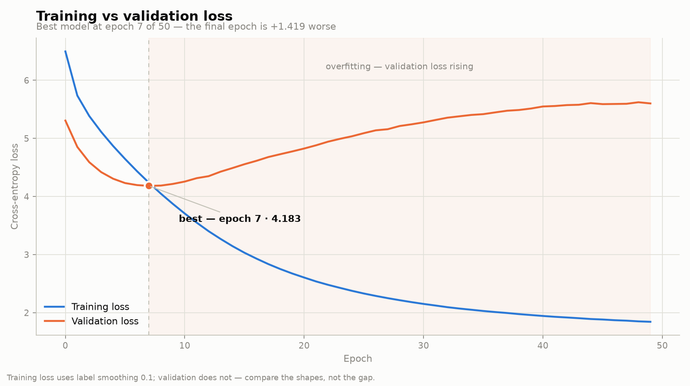

# Transformer-from-Scratch

A complete implementation of the Transformer architecture from scratch using PyTorch, trained on English-Italian translation.

## Features

- Full transformer architecture with multi-head attention
- Positional encoding and layer normalization
- Bilingual dataset with proper tokenization and masking
- Training pipeline with validation and greedy decoding
- GPU acceleration on NVIDIA (CUDA) and Apple silicon (Metal/MPS)
- TensorBoard logging for monitoring training progress

## Requirements

```bash
pip install -r requirements.txt
```

## Project Structure

```
.
├── model.py          # Transformer architecture implementation
├── dataset.py        # Bilingual dataset and data loading
├── train.py          # Training loop and validation
├── chat.py           # Interactive translation against a checkpoint
├── plot_losses.py    # Train/val loss curve from the TensorBoard logs
├── config.py         # Configuration parameters
└── requirements.txt  # Python dependencies
```

## Testing a Trained Model

```bash
python chat.py                                   # uses weights/tmodel_best.pt
python chat.py --checkpoint weights/tmodel_49.pt # any other checkpoint
echo "The book is on the table." | python chat.py
```

```
en -> it | weights/tmodel_best.pt (epoch 7, val_loss 4.183) | mps
> The book is on the table.
Il libro è al tavolo .
```

## Plotting the Loss Curves

```bash
python plot_losses.py        # writes loss_curve.png and loss_curve_dark.png
```



Validation loss bottoms out at epoch 7 and rises for the remaining 43 epochs
while training loss keeps falling — the model stops generalizing and starts
memorizing. `weights/tmodel_best.pt` is the epoch at the turn.

The script also prints a per-epoch table, so the numbers are available without
the chart.

## Configuration

Edit `config.py` to adjust hyperparameters:

- `batch_size`: Number of samples per batch (default: 32, tuned for GPU)
- `num_epochs`: Number of training epochs (default: 50, ~3.1h on Apple silicon)
- `lr`: Learning rate (default: 3e-4, scaled to match `batch_size`)
- `seq_len`: Maximum sequence length (default: 128)
- `d_model`: Model dimension (default: 256)
- `lang_src`: Source language (default: 'en')
- `lang_tgt`: Target language (default: 'it')
- `seed`: Seeds the train/val split so it is stable across runs (default: 42)

## How to Run

### Method 1: Direct Python Execution

```bash
python train.py
```

### Method 2: Debug Mode (Two Terminal Setup)

**Terminal 1 - Start TensorBoard:**

```bash
tensorboard --logdir=runs
```

Then open http://localhost:6006 in your browser to monitor training metrics.

**Terminal 2 - Run Training:**

```bash
# Regular mode
python train.py

# Or with Python debugger
python -m pdb train.py

# Or with VS Code/Cursor debugger
# Press F5 or use "Run and Debug" panel
```

### Method 3: Using Conda Environment

```bash
# Activate your conda environment
conda activate your_env_name

# Run training
python train.py
```

## Training Output

The training script will:

1. Download the `opus_books` dataset (en-it language pair)
2. Build tokenizers for source and target languages
3. Train the transformer model for the specified number of epochs
4. Save model checkpoints to `weights/` directory
5. Log training metrics to `runs/` directory for TensorBoard

## Model Checkpoints

Model weights are saved after each epoch:

- Location: `weights/tmodel_00.pt`, `weights/tmodel_01.pt`, etc.
- Contains: model state, optimizer state, epoch number, global step, val loss
- Each checkpoint is ~416MB (the Adam moment buffers are twice the model), so
  a 50-epoch run writes ~21GB

**Use `weights/tmodel_best.pt`**, which is rewritten whenever validation loss
improves. This model has 34.6M parameters and only 29k training pairs, so it
overfits well before the last epoch — the final checkpoint is usually *not* the
best one, and training loss will keep falling past the point where translation
quality starts degrading.

The end of the run prints where the optimum landed:

```
Best validation loss: 4.312 at epoch 21 -> weights/tmodel_best.pt
```

## Monitoring Training

View training progress in real-time:

```bash
tensorboard --logdir=runs
```

Metrics logged:

- `train_loss` — training loss per batch
- `val_loss` — validation loss per epoch, unsmoothed
- Validation examples with source, target, and predicted translations

Watch the two curves together. While both fall, the model is still learning.
When `val_loss` turns upward while `train_loss` keeps dropping, it has started
memorizing the training set and the useful part of the run is over.

## Environment Variables

Create a `.env` file for Hugging Face authentication (optional):

```
HF_TOKEN=your_huggingface_token_here
```

## Hardware Acceleration

The device is selected automatically at startup, in order of preference:

1. **CUDA** — NVIDIA GPUs
2. **MPS** — Apple silicon GPU via Metal (M1/M2/M3/M4, macOS 12.3+)
3. **CPU** — fallback

The selected device is printed when training starts:

```
Using device: mps
Apple Metal (MPS) backend enabled
```

No configuration is needed. If a rarely-used op is missing from the Metal
backend, `PYTORCH_ENABLE_MPS_FALLBACK=1` (set automatically in `train.py`)
runs just that op on the CPU rather than crashing.

### Getting the most out of Apple silicon

`config.py` ships tuned for the GPU: `batch_size: 32` and `lr: 3e-4`. A batch
of 4 leaves most of the GPU idle. Measured end-to-end (real dataloader, Apple
M5 Pro / 20 GPU cores, `seq_len=128`, `d_model=256`):

| Batch | samples/s | min/epoch |
| ----- | --------- | --------- |
| 4     | 60        | 8.1       |
| 16    | 118       | 4.1       |
| 32    | **131**   | **3.7**   |
| 64    | 132       | 3.7       |
| 128   | 125       | 3.9       |

Throughput plateaus at 32–64 and regresses past it, so 32 is the sweet spot:
essentially peak speed, while keeping twice as many optimizer steps per epoch
as 64. Peak memory is ~1.3 GB against ~55 GB available.

Two things that are *not* worth tuning:

- **`num_workers`** — throughput is identical at 0, 2, 4, and 8 workers. The
  step is GPU-bound, not dataloader-bound.
- **`batch_size` beyond 128** — at 512 the run collapses to 9 samples/s from
  memory thrashing.

Because a larger batch means 8x fewer optimizer updates per epoch, `lr` is
scaled from `1e-4` to `3e-4` to match. There is no warmup schedule in this
implementation, so raising `lr` much further risks diverging early in training.

### Using the spare capacity

At `d_model: 256` the model is 34.6M parameters and uses ~1.3 GB. There is room
for a substantially larger model — `d_model: 512` (the value from the original
paper) is 78.7M parameters at ~1.8 GB, and costs about 1.7x the time per step
(82 vs 136 samples/s at batch 32). That buys model capacity rather than speed,
so it is worth it only if you plan to train for enough epochs to use it.

## Performance Notes

- **CPU Training**: Expect ~2-5 seconds per batch on modern CPUs
- **GPU Training**: Significantly faster (recommended for production)
- **Memory**: ~2-4GB RAM for default configuration
- **Disk**: ~500MB for dataset and tokenizers

## Troubleshooting

**Slow training:**

- Reduce `seq_len` (e.g., 64 or 128)
- Reduce `batch_size` (e.g., 2 or 4)
- Reduce `d_model` (e.g., 128 or 256)

**Out of memory:**

- Reduce `batch_size`
- Reduce `seq_len`
- Use gradient accumulation

**Dataloader workers hang or crash on macOS:**

macOS starts worker processes with `spawn`, which re-imports the entry module.
Set `num_workers` to `0` in `config.py` to rule the workers out when debugging.

**Dataset download issues:**

- Check internet connection
- Set `HF_TOKEN` in `.env` file
- Try different dataset: change `lang_tgt` in `config.py`

## License

MIT
